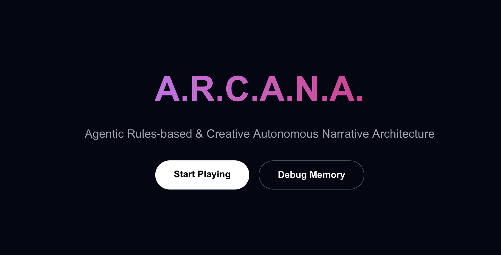

# A.R.C.A.N.A.
**Agentic Rules-based & Creative Autonomous Narrative Architecture**

"Erudite Automaton" – A fully autonomous AI Dungeon Master (DM) for D&D 5e.

---

## 📚 Table of Contents
- [Code Structure](#-code-structure)
- [Installation](#-installation)
- [Environment Setup Guide](#-environment-setup-guide)
- [Usage Examples & Demonstrations](#-usage-examples--demonstrations)
- [Reproducible Experiments & Analysis](#-reproducible-experiments--analysis)
  - [Experiment: Combat Flow Verification](#experiment-combat-flow-verification)
  - [Evaluation Results](#-evaluation-results)
- [Architecture & Implementation](#-architecture--implementation)
  - [Successful Implementation of Proposed Features](#-successful-implementation-of-proposed-features)
  - [Code & Performance Optimization](#code--performance-optimization)
- [Quality Assurance & Testing](#quality-assurance--testing)
  - [Unit Tests & Error Handling](#unit-tests--error-handling)
  - [Integration Testing](#integration-testing)
  - [Robust Error Handling](#robust-error-handling)
- [Comprehensive Documentation](#comprehensive-documentation)
- [Troubleshooting Guide](#-troubleshooting-guide)


---

## 📂 Code Structure

The project is divided into a Python-based backend (FastAPI + LangGraph) and a Next.js frontend.

```text
/
├── backend/                  # Core Logic
│   ├── app/
│   │   ├── agents/           # AI Agents (Orchestrator, Narrative, Rules, World)
│   │   ├── api/              # FastAPI Routes (Play, Debug)
│   │   ├── memory/           # Hybrid Memory (Neo4j + Vector Store)
│   │   ├── models/           # Pydantic Schemas
│   │   └── rules/            # Rules Adjudication Engine
│   └── scripts/              # Utility scripts (Seeding, Testing)
├── frontend/                 # UI
│   ├── app/                  # Next.js App Router Pages
│   └── components/           # React Components (CombatLog, InventoryPanel)
├── data/                     # Data Storage
│   ├── rules/                # D&D 5e Rules Data (JSON)
│   ├── story/                # Story Modules
│   └── logs/                 # Session Logs
├── scripts/                  # Root-level experiment scripts
├── tests/                    # Unit Tests
├── docker-compose.yml        # Infrastructure Definition
└── evaluation.ipynb          # Evaluation Process
```

---

## 🚀 Installation

> [!TIP]
> For a detailed, step-by-step setup guide for new teammates, please refer to [INSTRUCTION.md](INSTRUCTION.md).

### 1. Prerequisites
*   **Docker Desktop**: Must be installed and running. Download from [docker](https://www.docker.com/products/docker-desktop/).
*   **Google Gemini API Key**: Obtain one from [Google AI Studio](https://aistudio.google.com/).

### 2. Setup
Run the startup script to initialize your environment file.

```bash
chmod +x start.sh
./start.sh
```

**Note**: The script will likely pause or fail the first time because your API key is missing.

### 3. Run the Application
Start the entire stack (Backend + Frontend + Neo4j):

```bash
./start.sh
```

*   **Frontend**: [http://localhost:3000](http://localhost:3000)
*   **Backend API Docs**: [http://localhost:8000/docs](http://localhost:8000/docs)
*   **Neo4j Browser**: [http://localhost:7474](http://localhost:7474)

### 4. Seed the World (Required)
The database starts empty. Populate it with initial locations, NPCs, and relationships:

```bash
docker-compose exec backend python -m app.scripts.seed
```

---

## ⚙️ Environment Setup Guide

The project uses a `.env` file in the root directory.

| Variable | Description | Default |
| :--- | :--- | :--- |
| `GOOGLE_API_KEY` | **Required.** Your Gemini API Key. | None |
| `NEO4J_URI` | Address of the Neo4j database. | `bolt://neo4j:7687` |
| `NEO4J_USER` | Database username. | `neo4j` |
| `NEO4J_PASSWORD` | Database password. | `password` |
| `LLM_MODEL_NAME` | Model to use for generation. | `gemini-1.5-pro` |

---

## 🎮 Usage Examples & Demonstrations

### Web Interface
Navigate to [http://localhost:3000](http://localhost:3000), and you would see the start screen.

1.  Click **"Start Adventure"**.
2.  Type actions like *"I look around"* or *"I attack the goblin"*.
3.  View your **Inventory** and **Stats** updating in real-time.


### API Usage
You can interact directly with the backend via HTTP.

**Start a Session:**
```bash
curl -X POST "http://localhost:8000/api/play/start_session" \
     -H "Content-Type: application/json" \
     -d '{}'
```

**Take an Action:**
```bash
curl -X POST "http://localhost:8000/api/play/step" \
     -H "Content-Type: application/json" \
     -d '{
           "session_id": "YOUR_SESSION_ID",
           "text": "I attack the goblin with my sword!"
         }'
```

---

## 🧪 Reproducible Experiments & Analysis

We provide scripts to verify the core mechanics of the system, specifically the Combat Flow.


### Experiment: Combat Flow Verification
This experiment tests the end-to-end flow of:
1.  Initializing a session.
2.  Retrieving the current state.
3.  Processing a combat action ("I attack...").
4.  Verifying that the `action_log` (combat resolution) is generated.

**Run the Experiment:**
Ensure the stack is running (`./start.sh`), then run:

```bash
python scripts/test_combat_flow.py
```

### Automated Unit Tests
To run the backend unit tests (ensuring API health and basic game flow):

```bash
python -m pytest tests/
```

---

## 📊 Evaluation Results

We have conducted a comparative analysis between **A.R.C.A.N.A.** and a baseline LLM (Gemini 1.5 Pro).
The results, including score distributions and qualitative analysis, can be found in:
*   [evaluation.ipynb](evaluation.ipynb)

**Key Findings:**
*   **Performance:** A.R.C.A.N.A. achieved a mean score of **4.62/5.0**, significantly outperforming the baseline (3.90/5.0).
*   **Consistency:** The agentic architecture demonstrated much lower variance in output quality.

**Expected Output:**
```text
1. Starting Session...
Session ID: ...
2. Sending Attack Command...
Response received.
[SUCCESS] Action Log Found:
[
  {
    "type": "attack",
    "description": "...",
    "damage": ...
  }
]
```

---

## 🏗️ Architecture & Implementation

*   **OrchestratorAgent**: Manages the game loop, detects user intent, and delegates tasks.
*   **NarrativeAgent**: Generates immersive story text using Google Gemini.
*   **RulesLawyerAgent**: Adjudicates actions based on D&D 5e rules.
*   **Memory System**:
    *   **Episodic**: Vector Store (Chroma) for narrative history.
    *   **Semantic**: Temporal Knowledge Graph (Neo4j) for game state (HP, Inventory, Locations).

---

## 🛠️ Data Monitoring

Visualize the game world and memory in the Neo4j Browser.

1.  Go to [http://localhost:7474](http://localhost:7474)
2.  Login with `neo4j` / `password`.
3.  Run this query to see the entire graph:
    ```cypher
    MATCH (n) RETURN n
    ```

---

## 🐛 Troubleshooting Guide

For a comprehensive guide on common issues (API keys, database connections, logging), please refer to [TROUBLESHOOTING.md](TROUBLESHOOTING.md).

| Issue | Solution |
| :--- | :--- |
| **API Key Error** | Check `.env` file and ensure `GOOGLE_API_KEY` is set. |
| **Database Empty** | Run the seed command: `docker-compose exec backend python -m app.scripts.seed` |
| **Connection Refused** | Ensure Docker containers are running: `docker-compose ps` |
